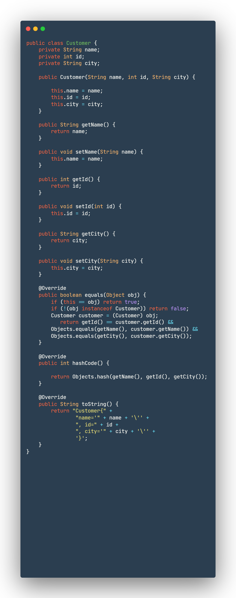

## Chapter[4]

### Data Classes ❤️

1. **What is a Data class?**
   * Fundamentally, Data Class is a simple class that is used to _**hold data or state**_, and includes standard functionality.
   * It refers to a class, which contains only fields and crude methods for accessing them **_(getters and setters)._**
   * By using `data` keyword, you can create a data class.
2. Data class rules:
   * It must have a primary constructor with at _least one parameter_.
   * It cannot be a **`sealed` class, `open`, `inner`, or `abstract`.**
   * Each parameter must indicate `var` or `val`.
   * It can inherit another class, and implement an `interface`.

## Data class Example

### **Java** 😕



#### **Kotlin** ❤️

* We can rewrite the above example in kotlin with single line of code ❤️ 🎉️

```
data class Customer(
   val name: String,
   val id: Int,
   val city: String
)
```

> 1. The compiler will generate the `copy()`, `toString()`, `equals()`, `hasCode()` for us. ❤️
> 2. **Primary constructor parameters** will be included in the generated implementations of `copy()`, `equals()`,` hashCode()`, and `toString()`.
> 3. Data class may also contain properties that are not defined in the primary constructor but will not be included in *compiler-generated methods*.

```
data class Customer(
   val name: String,
   val id: Int,
   val city: String
){
   // This property will not be included in compiler-generated methods.
   var country: String = ""
}
```

3. Data class has _built-in_ functions:
   * `equals() : Boolean`
   * `hasCode(): Int`
   * `toString(): String`
   * `copy()`
   * `componentN()`

## `equals()`

* It compares the parameters of the **primary constructor** only (has same `hashCode()`. Read about `hashCode()` method in below).

  ```
  fun main() {
    val customer1 = Customer("Customer 1", 10, "Egypt")
    val customer2 = Customer("Customer 2", 20, "Giza")

    /**
     * If name, id, and city are the same, it returns true otherwise, returns false
     */

    if (customer1 == customer2)
        println("Identical")
    else
        println("Not same")
    }

  ```


> To compare whether two objects are **structurally** the same, the equivalent of calling `.equals()`, use `==`. To check whether two variables **point to the same object**(reference), use `===`.

## `toString()`
 * It returns a string representation of the object. 
 
> `toString()` is useful for **debugging or output**, but if you require all properties to be included, you will have to ensure that all properties are present in the primary constructor or override `toString()`.

## `copy()`
* It can be used to copy a data class.
* We can use named arguments to modify specific properties on the copied class.

`val copiedCustomer = customer1.copy(name = "Customer 3", id = 2)`

> It is suggested to apply `val` parameters in a data classes constructor in order to use _immutable properties_ of an object.
> Immutable objects are easier when you want to work with _multithreaded_ applications.

## `hashCode()`
* It returns hash code for the object. If two objects are equal, `hashCode()` produces the same integer result.

