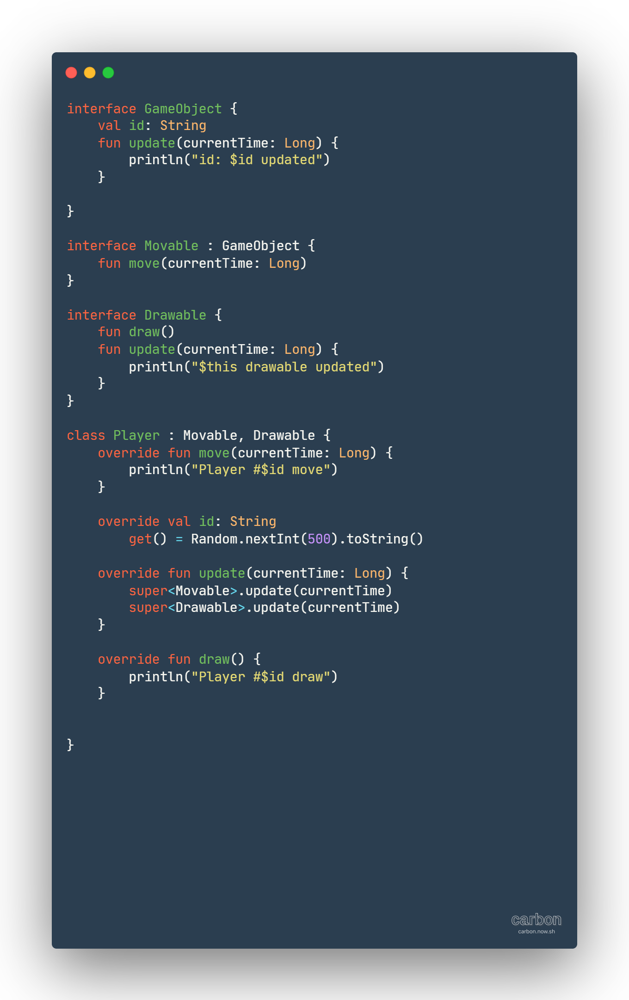

#### Let's connect
  [Linkedin](https://https://www.linkedin.com/in/hassanmohammed1997/)

  [Twitter](https://twitter.com/dracula1597)
  
  ---
## Chapter [4]

### Achieving inheritance and composition (Notes)

1. **Interfaces**
   * may define **_default_** method definitions
   * may also define interface **_properties_** _(can be abstract or include a default implementation)_
   * It's possible to provide a **default value** for the interface property. In such a case, it's no longer required to override the property in any implementing class.
2. **Interface Inheritance**
   * A class can implement **_multiple_** interfaces.
   * Any class that implement a child interface which extends from parent interface will be
     required to implement the parent and child interface methods and properties if required

> What happens if two interfaces both have identical methods with different default implementations?

* When any class implements multiple interfaces with identical methods, the code will not compile even through all methods are either implemented or have a default implementation. This is because the compiler knows that the `method` has two inherited implementations from the superclasses.
* The compiler will force us to _override_ the `method` to disambiguate which implementation to use.
> This is likely not a common occurrence, but without this ability features such as default interface method implementations would be far more restricted.

> When implementing an interface, we don't always have to implement all the interface methods. We can define our class as `abstract` and let a subclass finish the interface implementation.

---

3. **Subclasses and abstract classes**
   *  If we want to define a class that implements an interface but doesn't provide implementations for all the required methods, we can mark the class as `abstract`.
   * If you want to make a class to be extended, it must use the `open` keyword.
   * * If you want to override a _non-interface method_, it must be marked as `open`.
   * Once a method has been overridden, it is `open` by _default_.
   *  If you want to prevent a method to be overridden once an implementation is provided, an overridden method can be marked `final` to **_prevent future modification._**
> `open` indicate the compiler that a class is open for extension

---

4. **Nested classes**
   * A class defined within another class is not treated as an `inner` class by _default_, meaning it does not have an implicit reference to the enclosing class.
> By default, Nested class cannot access reference of the outer class and its properties but by using `by` keyword you can access it..

